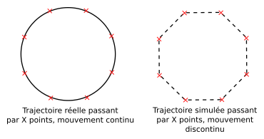
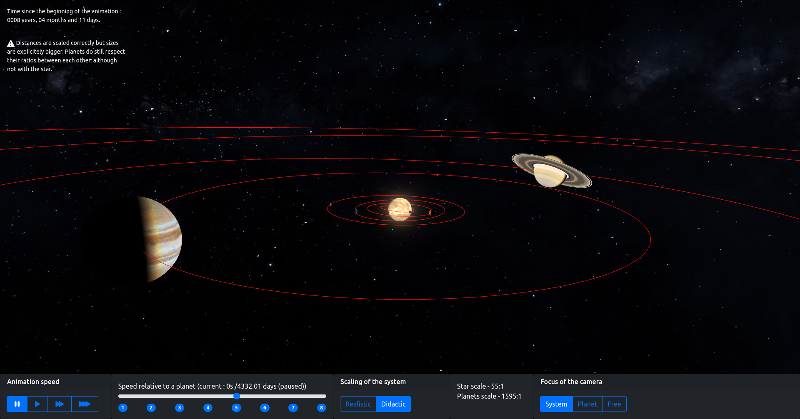

\makeutbmfrontcover{}

\newpage

## Remerciements

Avant de présenter le produit de mon stage, je tiens à remercier l'Observatoire de Paris - notamment le Laboratoire d'Études Spatiales et d'Instrumentation en Astrophysique, LESIA - de m'avoir reçu pour ce stage d'assistant ingénieur. Travailler pour un tel organisme est une véritable fierté pour le passionné d'astrophysique que je suis, et j'ai peut-être trouvé ma vocation grâce à l'Observatoire.

Je souhaite ensuite remercier tout particulièrement Françoise Roques, à la tête du projet Exoplanètes, de m'avoir permis d'intégrer son équipe. Elle a été toujours très compréhensive devant mon travail et m'a donné des pistes sérieuses pour l'avancement de l'application sur laquelle j'ai travaillé. Je remercie également Quentin Kral, membre de l'équipe, qui m'a fourni une aide précieuse pour la partie calculatoire entre autres et sans qui je n'aurais jamais pu mettre au point le coeur de mon application.

Mon collègue Ulysse Chosson, récemment diplômé ingénieur et ayant rejoint le projet en même temps que moi, s'est montré très bienveillant et sympathique tout au long du stage. Je l'ai beaucoup cotoyé car nous travaillions toujours dans le même petit groupe au sein du projet, bien que sur des aspects différents. J'ai toutefois eu recours à son travail pour les besoins de mon application, et je le remercie de m'avoir épaulé sur cet aspect du projet. De manière générale, mon stage n'aurait pas été aussi léger sans nos discussions tout aussi diverses qu'intéressantes.

Et enfin mes plus grands remerciements vont à mon tuteur de stage, Pierre-Yves Martin. Réel passionné comme moi - aussi bien en informatique qu'en astrophysique - je me suis retrouvé en lui dès le début et notre collaboration a été extrêmement positive pour moi, comme pour lui je l'espère. Il m'a appris tout ce que vous allez lire dans ce rapport, en étant toujours très patient et pédagogue. Très porté sur la rigueur, il m'a transmis l'envie de faire mon travail le plus finement possible tout en étant libre de tester tous les choix possibles. Pierre-Yves a été un mentor parfait, et je souhaite à toute personne de travailler un jour avec quelqu'un d'aussi impliqué et jovial.

\newpage

\tableofcontents

\newpage

## Introduction

(_Tout texte entre parenthèses et emphasé est une de mes notes pour toi PYM. C'est ce que je compte ajouter avec ton aide, ou modifier selon ce qui te paraît le plus cohérent._)

(_Origine du projet, création de la base de données par Jean Schneider._)

Le site exoplanet.eu reste aujourd'hui une référence mondiale pour répertorier et consulter les découvertes liées aux exoplanètes. Dans une volonté de moderniser le site et de le rendre plus accessible au plus grand nombre (étudiants, enseignants, chercheurs...), un remaniement général du site a été entamé quelques mois avant mon arrivée. L'introduction d'une nouvelle gestion de la base de données, avec le format EXODAM - développé par Ulysse Chosson, ingénieur sur le projet Exoplanet.eu - est l'un des points-clés pour centraliser la réception et la consultation des données sur les exoplanètes. Le site doit également se doter d'une nouvelle charte graphique et d'une navigation allégée, grâce au travail de mon tuteur Pierre-Yves Martin, ingénieur d'études sur le même projet.

Deux autres personnes viennent compléter l'équipe réduite de ce projet : Quentin Kral (_expliciter son rôle_), et Françoise Roques à la tête du projet (_expliciter son rôle également_). Jean Schneider fait également partie du projet à titre de consultant, sa contribution au projet étant logique puisqu'il s'agit à l'origine de ses travaux. (_Parler également de Florence et de Cyril_). Il faut retenir que les personnes travaillant principalement sur le projet Exoplanet sont Ulysse, Pierre-Yves, Quentin et Françoise.

(_Organigramme de l'équipe_).

Un troisième aspect a été envisagé pour le nouveau site : la modélisation en 3D des exosystèmes planétaires. La NASA a réalisé une application similaire, qui reste tout de même très sommaire et assez lourde à manipuler. C'est ainsi qu'a été pensé mon sujet de stage, je devrai réaliser une application permettant de visualiser des exoplanètes quelconques à partir des données fournies par le site exoplanet.eu - application qui sera implantée dans le site lui-même par mon tuteur. L'objectif s'accompagne d'une volonté de réaliser un produit plus performant et plus pédagogue que celui déjà existant de la NASA. C'est avec ces informations en tête que je démarrai mon stage d'assistant ingénieur auprès de Pierre-Yves.

\newpage

## Lexique et terminologie

| Termes d'origine  | Domaine rattaché     | Définition                                                                                                                                                                                                                       |
| ----------------- | -------------------- | -------------------------------------------------------------------------------------------------------------------------------------------------------------------------------------------------------------------------------- |
| Sprint            | Méthode agile        |
| Main              | Git & GitLab         | La version officielle et principale du projet. C'est celle qui est accessible au public (lecture seule).                                                                                                                         |
| Branche           | Git & GitLab         | Une copie sur du projet sur laquelle les développeurs peuvent travailler. Elle peut ensuite être intégrée au main avec l'accord des gestionnaires du Git.                                                                        |
| Commit            | Git & GitLab         | Une sauvegarde locale d'une portion de branche. Plusieurs commits permettent de recenser des modifications régulières sur cette branche.                                                                                         |
| Push              | Git & GitLab         | L'action de sauvegarder toutes les modifications d'une branche sur la version en ligne du Git. Un push doit contenir au moins un commit, et peut être suivi par un merge request.                                                |
| Merge (request)   | Git & GitLab         | L'action de fusionner une branche avec le main. Le request est la demande de cette action adressée aux gestionnaires.                                                                                                            |
| Issue             | Git & GitLab         | Une fonctionnalité ou un problème à régler dans le cadre d'un sprint, elle doit être traitée dans une branche.                                                                                                                   |
| Milestone         | Git & GitLab         | Un ensemble d'issues à terminer pour achever un objectif majeur.                                                                                                                                                                 |
| V1 / V2 / V3      | Spécifique au projet | Ces termes désignent les grandes catégories du projet sous formes de milestones. Chaque V (version) correspond à une ou plusieurs fonctionnalités-clés à mettre en oeuvre avant de passer à la suivante.                         |
| Refactoring       | Développement        | Un processus de réécriture du code pour le rendre plus propre et/ou conforme à un standard de développement particulier. Un refactoring ne doit pas modifier le fonctionnement du programme, seulement la structure de son code. |
| Mesh (pl: meshes) | Développement 3D     | Un ensemble de formes géométriques assemblées pour représenter une forme en 3D.                                                                                                                                                  |

\newpage

## Quels outils choisir ?

J'avais beaucoup échangé avec Pierre-Yves pendant les vacances, à propos de la marche à suivre pour le déroulé du projet et des potentiels outils à utiliser. Nous souhaitons intégrer l'application au site Web, aussi le choix le plus évident est le langage JavaScript, qui apporte le support 3D au format HTML/CSS (entre autres fonctionnalités, le support 3D reste notre priorité). Toutefois le développement pur et dur n'est pas notre seule tâche, et il nous faudra plus que ces langages pour y parvenir.

### JavaScript et librairies 3D

Le JS possède du support natif pour la gestion d'environnements 3D, cependant il est très peu accessible et difficilement malléable. Il est préférable de ne pas réinventer la roue, et de se tourner vers des librairies existantes qui proposent des fonctions et classes plus faciles à utiliser. Ainsi, nos deux candidats pour le développement de l'application sont Three et Babylon. La première est la plus large, elle permet une manipulation totale de l'environnement 3D, moyennant une connaissance pointue de la librairie. La seconde est construite à partir de la première, et propose des outils plus intuitifs et regroupant davantage d'options ; cela implique un contrôle moindre sur l'environnement car Babylon gère beaucoup d'interactions en interne, on gagne cependant en facilité de prise en main et d'utilisation.

Sous les conseils de Pierre-Yves, j'ai procédé à une comparaison des deux librairies en réalisant plusieurs mini-applications avec chaque langage. Je n'ai en réalité eu aucun succès avec Three en raison de problèmes d'import, de plus Babylon s'est révélé plus efficace en pratique que Three ne l'est en théorie, grâce aux manipulations de caméras dans l'environnement 3D notamment. Un extrait de mes notes est disponible en annexe pour détailler ce résultat. J'ai donc choisi d'utiliser l'outil Babylon pour développer l'application.

### Babylon.js : le moteur et cerveau de l'application

Babylon.js est donc un moteur de rendu 3D conçu pour les sites Web, et se présente sous la forme d'une librairie Typescript compatible avec JavaScript. Il est régulièrement mis à jour, et nous l'avons d'ailleurs constaté en plein développement, lorsqu'une fonctionnalité dont nous avions besoin a été améliorée. Une coïncidence bien pratique, qui renforce mon opinion positive à propos de cette librairie et de tout le support qui l'entoure.

Au-delà de la pléthore d'éléments pour la création et la navigation au sein d'un environnement 3D basique, Babylon propose également beaucoup de fonctions mathématiques très utiles pour les éventuels changements de repère ou encore les transformations de vecteurs. Il me semble que tout ceci est en totale adéquation avec la manipulation des éléments 3D en informatique, bien que je n'ai pas encore étudié la théorie à ce sujet - ce sera a priori l'objectif de mon premier semestre de sépcialisation, en rentrant du stage.

Il est important de noter que de nombreuses décisions concernant le développement ont été faites en faveur de Babylon et non de l'exactitude scientifique requise. Il va de soi que nous avons fait le maximum pour concilier les deux, mais quand ce n'était pas possible, c'est la nécessité de se rapprocher du fonctionnement de Babylon qui l'a emporté. Vous en verrez un exemple très concret lors de la gestion du temps au sein de la simulation, où les formules mathématiques complexes se sont heurtées à un fonctionnement hermétique de Babylon.

A posteriori, le choix de Babylon a été grandement valorisé par sa très vaste documentation. Des tutoriels pour tous les niveaux y sont fournis, elle est à jour avec les dernières versions de Babylon et le Git de la librairie est accessible au public (ce qui m'a été très pratique pour l'étude approfondie des fonctions mathématiques que la librairie propose). J'ai toujours au moins un quart de mes onglets ouverts pour de la documentation Babylon, et je suis très satisfait de la qualité et la quantité qu'elle propose.

### Git : espace de travail et planification

Git est un outil bien connu des développeurs, il est indispensable à tout projet bien organisé car il sert aussi bien de journal de bord que d'espace de travail. J'avais déjà entendu parler de Git mais je ne m'en étais jusqu'alors servi que très brièvement, laissant le soin à d'autres camarades de projet sa gestion. Ici, je suis le développeur principal de ce projet et j'ai donc dû apprendre à utiliser cet outil pour garder mon code organisé et soigné. Pierre-Yves m'a donc présenté divers concepts : les branches, les 'commit', les 'push', les 'merge'... Nous allions également superviser l'avancement de mon travail via un GitLab associé à l'Observatoire. Nous pourrons y recenser les 'issues', les 'milestones' et les 'merge requests'.

Nous avons alors imaginé un grand découpage du projet en trois étapes :

- première version : réaliser une simulation du système solaire en guise d'exemple, avec une majorité de fonctionnalités.
- deuxième version : étoffer manuellement l'application avec la base de données de l'Observatoire, en créant des systèmes exoplanétaires quelconques.
- troisième version : intégrer complètement l'application au site exoplanet.eu, en automatisant la création de systèmes par l'application.

Je devrai alors travailler ces grandes étapes en les divisant en plus petits blocs (des 'issues'), et je créerai une branche sur le Git pour chaque bloc ainsi traité. Chaque petite avancée dans ces blocs devra être marquée et archivée par un 'commit', et une fois le bloc terminé, nous fusionnerons ma branche de travail avec le 'main', c'est-à-dire la branche principale du projet.

### Choix de l'éditeur de code : Visual Studio Code

VSCode est un éditeur que je connais depuis longtemps, il est simple à maîtriser et très personnalisable. C'est également l'éditeur de mon tuteur, et il possède du support très pertinent pour le branching de Git - par exemple l'affichage des fichiers modifiés et qui n'ont pas été 'commit'. VSCode est très flexible comme je l'ai mentionné, grâce à ses nombreux modules améliorant la qualité du code et rendant le développement plus agréable. C'est donc un choix naturel vis-à-vis de nos besoins et attentes pour ce projet.

### Coder le plus rigoureusement possible : pre-commit, Standard et Prettier

Pierre-Yves a insisté tout au long du stage sur l'importance de conserver un code lisible, cohérent et en règle avec tous les standards de développement. C'est un point auquel je n'étais pas sensible au début de mon stage, et bien que j'ai pu en voir les bénéfices directs après quelques semaines, il a fallu encadrer mon travail dès le départ pour que je m'y habitue.

Tout d'abord nous avons mis en place 'pre-commit', un intermédiaire entre mon code et le Git. Il analyse mon travail selon des critères précis - longueur des lignes, présence de caractères interdits, non-respect d'une règle du JavaScript... - et m'empêche d'ajouter mon travail à la branche si je ne respecte pas la totalité de ces critères. Pour analyser mon JavaScript et le comparer à des règles existantes, nous nous basons sur le Standard : la norme la plus fine sur l'utilisation du JS en mode strict (_développer les explications sur le mode strict_).

La base de modules de VSCode fournit un autre outil pour m'aider dans ce sens : Prettier. Lorsqu'il est configuré pour respecter le Standard, il corrige automatiquement toutes les parties du code qui ne sont pas conformes lors de la sauvegarde du fichier. Ainsi, le croisement de 'pre-commit' et de Prettier configurés au Standard garantit un code irréprochable sur la forme. Toutefois le fond reste la responsabilité de la personne derrière le clavier : c'est à moi de connaître les usages et les bonnes pratiques du JavaScript. Heureusement, je peux compter sur l'expérience de mon tuteur pour m'améliorer dans ce sens.

### Et bien d'autres outils...

Nous avons eu recours à un grand nombre d'outils intermédiaires, ajoutés au fur et à mesure dans le projet. Ils ont tous leur importance, comme 'jest' pour tester l'exactitude des calculs dans le code, cependant ils sont trop nombreux pour être recensés ici. Ils sont toutefois tous listés et documentés dans le fichier 'CONTRIBUTING.md' du projet, que vous trouverez également en annexe.

\newpage

## Avant le développement du projet : apprentissage et prototype

Je débute mon stage avec mon ordinateur de travail, mon bureau et mes identifiants, j'ai donc tout ce qu'il me faut pour commencer à travailler. Enfin presque...

### Mon organisation de travail générale

Tous les outils sont prêts, cependant je débute à peine mon stage et je ne maîtrise pas le JavaScript. Par ailleurs, il faut encore découper le projet en de multiples sous-parties - des 'sprints' - grâce une méthode agile. C'est un processus itératif, qui s'assure que l'application fait exactement ce qui est attendu avant de passer à la suite, orientant ainsi le développement en fonction des obstacles qui se présentent.

En pratique, je choisis une 'issue' à traiter selon un ordre arbitraire (le plus souvent, j'ai choisi des fonctionnalités qui m'intéressaient et/ou qui me semblaient vitales pour le projet). Après avoir prévenu mon tuteur, nous en discutons ensemble s'il faut prévoir un design particulier - nécessaire pour les fonctionnalités majeures. Ensuite, je développe ce design jusqu'à obtenir une première version fonctionnelle. Je la teste - à l'aide d'outils tels que Jest s'il y a le moindre calcul mathématique entre autres - et je passe en revue ce qui devrait être corrigé et ce qui peut être conservé. Lorsque cette 'issue' est traitée, je note les conséquences qui découlent de ce nouveau morceau de l'application (bugs éventuels, modifications d'autres fonctionnalités, implémentation de nouvelles fonctionnalités...) et je demande à Pierre-Yves de relire mon travail. S'il est irréprochable sur le fond et la forme, le travail est validé et ma branche de développement subit un 'merge', ce qui la rattache à la branche principale. Dans le cas contraire, je corrige autant de fois que nécessaire les coquilles dans mon travail. Je peux ensuite passer à la branche suivante - en pratique, il m'est arrivé de travailler sur plusieurs branches en parallèle, toutefois j'évite au maximum cette pratique car elle a bien trop souvent causé des problèmes de retard de version entre certaines branches. Cette méthode de travail permet d'avoir un projet toujours fonctionnel, même s'il est incomplet.

Il n'est pas rare que terminer une 'issue' en ouvre deux nouvelles - sans compter bien sûr les 'issues' qui nous sont venues en tête plus tard - ainsi nous sommes passés d'à peine dix 'issues' au mois de septembre à près de cinquante au mois de décembre, pour arriver près des soixante à la toute fin du stage. Nous avons donc utilisé l'outil GitLab pour les lister au fur et à mesure, en fermant les 'issues' traitées. C'est également lors de la première réflexion avec mon tuteur que j'ai convenu d'un nom pour cette partie du projet Exoplanet.eu : je travaillerai sur le développement de l'application 'Exo3D'. J'ai alors commencé par mettre au point un Proof Of Concept.

### Les débuts d'Exo3D avec un PoC

D'une façon similaire à la phase de sélection de la librairie, je fais mes premiers pas en JavaScript avec des fonctions très simples. On commence donc par placer une sphère au centre de l'environnement graphique, puis on introduit une autre sphère en mouvement autour de la première. La première simulation d'orbite est un succès immédiat, qui a été notamment facilité par mon expérience en la matière. En effet, j'avais déjà réalisé des calculs de trajectoire de corps célestes lors d'un projet de découverte en astrophysique (dans le cadre de l'UV AC20 enseignée à l'UTBM).

L'un de nos objectifs principaux est la représentation des exoplanètes au sein de leur système, aussi il est crucial de bien choisir notre représentation de ces objets. Parmi la liste des premières 'issues' importantes, on retrouve la gestion de la vitesse de simulation, l'aspect des objets spatiaux et la gestion des angles de vue de la scène. Dès la fin de la deuxième semaine de stage, j'avais réussi à modéliser un pseudo-soleil avec une Terre gravitant autour, avec la possibilité d'accélérer (vitesse doublée), ralentir (vitesse réduite de moitié) ou arrêter ce mouvement. Ce mouvement restait toutefois très sommaire, l'objet se téléportant d'un point à l'autre de sa trajectoire.

Nous avions également implémenté deux nouvelles caméras, en plus de celle basique centrée sur le Soleil. La première peut suivre l'unique planète du système, la seconde est libre et n'a pas de cible particulière - elle se déplace librement grâce aux contrôles du clavier. À partir de là, Pierre-Yves m'a montré comment passer nos fichiers .js en fichiers .mjs : ce sont maintenant des modules, et ils sont intégrés comme tels par le navigateur. Ceci a donc demandé de nettoyer un peu le code et de l'adapter pour qu'il gère mieux cette nouvelle particularité, ce fut le premier 'refactoring'. C'est également à partir de cet instant que j'ai pu constater une légère amélioration des performances graphiques : utiliser des méthodes de programmation optimisées et strictes avait un impact bien visible sur notre application.

J'ai ensuite amélioré le rendu général du Soleil et de la Terre - le Soleil "émet" maintenant de la lumière - en plus d'ajouter la Lune comme satellite à la Terre. Le tout n'avait pas encore d'environnement, il n'y avait qu'un fond gris. J'ai donc introduit une texture de fond étoilé de la Voie Lactée. Une question avait été soulevée à ce sujet : devrait-on tenter de changer le fond étoilé pour chaque système, en fonction des étoiles qui devraient être visibles depuis cet endroit ? La réponse est non, car nous ne pouvons pas voir certaines étoiles dont la lumière ne nous est pas encore parvenue. Nous ne pourrions donc que deviner et inventer des étoiles selon l'exosystème choisi, le choix de la Voie Lactée a donc été accepté à l'unanimité y compris en dehors du Système Solaire. Ce genre de problèmes doit toujours être discuté avec Françoise et Quentin, car notre application doit avant tout refléter la réalité des observations astronomiques : on doit donc penser à trouver une alternative cohérente lorsque certaines données nous manquent.

Toutes ces fonctionnalités ont démontré un certain succès de l'application jusque-là, et Pierre-Yves a choisi ce moment pour clore le PoC et débuter pleinement la première version. C'est ainsi que le 6 octobre 2021, j'ai entamé la V1 en passant tout le projet sous forme de classes et d'objets : c'était le deuxième 'refactoring'.

## Version 1.0.0 : Simulation du système solaire

L'objectif de ce 'milestone' est d'avoir une application presque aboutie, mais dont les seules données sont celles du système solaire. Le prototype s'orientait déjà dans cette direction pour faciliter le développement. D'ailleurs pour être parfaitement honnête, je n'avais pas conscience de travailler sur un PoC ; cela avait bien été mentionné mais il me semblait être dès le début sur le développement de la V1. C'est Pierre-Yves qui a souligné que ce que j'avais travaillé jusqu'ici était une base solide, mais ce n'était pas encore la V1. Étant donné que nous travaillions sur un prototype, il était acceptable d'être imprécis ou de choisir des raccourcis, ceci afin de s'assurer qu'une solution semble viable avec des paramètres simples. Si en revanche une fonctionnalité était bancale ou difficile travailler, et ce dès cette phase de prototypage, alors cela nous permettait d'économiser du temps en mettant de côté cette option. Il était donc temps de commencer la véritable application.

### Conflits entre rigueur scientifique et limites de programmation

Pour entamer la V1, j'ai re-travaillé les calculs de trajectoires. Jusqu'ici, il ne s'agissait que d'une formule basique pour créer un cercle avec une centaine de points. Il nous fallait à partir de maintenant des ellipses quelconques, ainsi qu'un mouvement des planètes conforme à la réalité.

L'un des gros problèmes a été la gestion du temps et d'éventuelles fonctions paramétriques pour le mouvement des planètes. En effet, nous souhaitions obtenir un mouvement continu et fluide visuellement, mais cela s'est avéré incompatible avec le fonctionnement de Babylon. Cette solution aurait nécessité d'utiliser un grand nombre de points (de l'ordre du million pour certains trajectoires très larges), ou d'avoir beaucoup de mémoire disponible pour calculer les trajectoires "en temps réel". De plus, Babylon ne permet de déplacer les objets 3D (les 'meshes') de façon continue, pas de cette manière en tout cas. Le résultat est donc une trajectoire imprécise, beaucoup plus polygonale qu'elliptique, et avec des objets qui se "téléportent" de point en point.

Il a donc fallu poser un dilemme crucial au sein de ce développement : doit-on tenter de respecter les formules mathématiques et les concepts physiques - quitte à s'éterniser sur le développement - ou bien doit-on renoncer à certaines d'entre elles au profit d'un développement plus efficace ? Nous avons testé en tout quatre solutions situées à des points différents de cette opposition, et attribué un vote à chacune d'entre elles en fonction de critères communs (respect des formules, simplicité de développement, rendu visuel pertinent...) C'est finalement la solution suivante qui a été retenue : le système d'animation interne à Babylon. Celui-ci applique moins bien les formules que les trois autres, cependant il gagnait haut la main sur tous les autres critères : il est facile à mettre en place et à manipuler, les mouvements qu'il permet sont parfaitement fluides, et il peut simuler certains comportements physiques de façon assez propre. Le détail de son fonctionnement est disponible dans le fichier `docs/detailled_doc.md` du projet.

Et bien que j'ai parlé d'inexactitude scientifique dans cette solution, il faut doser cette information : le mouvement simulé des planètes est si proche de leur véritable ellipse qu'il est impossible de détecter la moindre différence à moins de les comparer à échelle microscopique. Ce n'est donc pas la pure réalité physique, mais je pense qu'on peut estimer qu'elle s'en approche à plus de 95%. De réelles différences se manifesteraient en cas de trajectoires plus inhabituelles, comme dans des problèmes à trois corps et autres mouvements chaotiques. J'ai déjà travaillé sur ces cas lors de mon AC20, et je suis certain que mon modèle ne tiendrait pas la route face à ces situations, toutefois mon tuteur m'a assuré que nous ne ferions pas face à des problèmes de ce type.

### Huit planètes au lieu d'une : complétion du système

Jusqu'ici, seule la Terre gravitait autour du Soleil. Il a donc fallu commencer à ajouter les autres, et ce fut la partie suivante du développement. Je l'ai peu souligné jusqu'ici, mais la rigueur et les connaissances de Pierre-Yves m'ont été très utiles pour créer un projet très malléable. Ajouter plusieurs planètes à une application prévue pour une seule planète a été un jeu d'enfant, car tout avait été pensé dès le deuxième 'refactoring' et le passage en classes. De manière générale, une fois qu'une nouvelle fonctionnalité était créée dans son ensemble, elle était alors très facile à modifier ultérieurement et à relier à de nouvelles options. Bien que j'ai été très réticent à l'idée d'être constamment relu par mon tuteur au départ, j'ai vite compris ce qu'il attendait de moi et j'ai pu travailler bien mieux que je ne l'ai jamais fait.

Une fois les sept autres planètes ajoutées au système, il a fallu modifier toutes les autres fonctionnalités qui leurs sont dédiées. Ainsi, de meilleures caméras ont été mises au point pour pouvoir suivre chaque planète plus efficacement. Nous avons aussi ajouté une première version des anneaux de Saturne, bien que le rendu ne soit pas si convaincant que ça, encore aujourd'hui.

J'ai également passé la totalité du projet en anglais, car jusqu'ici la documentation et les commentaires étaient en français. En effet le site exoplanet.eu a une portée internationale, et il est préférable de choisir l'anglais par défaut en attendant une traduction dans plusieurs langues (c'est une possibilité qui a été évoquée, toutefois cela ne sera pas une de mes missions). Ce fut un bon exercice pour travailler mon niveau d'anglais et m'assurer que je n'avais pas régressé depuis mon entrée en branche - cela faisait plus d'un an que je n'avais pas pratiqué l'anglais couramment, car je m'étais tourné vers d'autres langues après l'obtention de mon BULATS.

Enfin, j'ai créé une véritable interface utilisateur grâce aux composants Bootstrap, remplaçant les boutons placés au jugé sur la page par un panneau de contrôle propre et organisé. La façon dont est présenté ce panneau vise à rappeler un lecteur de vidéo - comme celui de Youtube - avec des boutons Pause/Lecture en bas à gauche et le reste des fonctionnalités sur le reste du panneau. C'est une idée de Pierre-Yves, que j'ai tout de suite trouvé très intéressante : cela ajoute un côté plus moderne et plus intuitif à l'application.

(_Schéma comparatif UI contre lecteur vidéo._)

Nous avons donc les huit planètes du système solaire et la majeure partie des outils à implémenter sont présents. Un autre défi s'oppose maintenant à nous : la gestion des échelles dans l'espace.

### Système réaliste et système didactique : l'échelle spatiale

Pour une première approche de la complétion du système, j'avais arbitrairement choisi des tailles et des distances proches les unes des autres. À présent, il faut proposer des échelles correctes et réalistes, en effet c'est un autre grand objectif du projet Exo3D. J'ai donc récolté les données dont j'avais besoin à propos du système solaire et les ai intégrés à l'application. C'est à cet instant que j'ai pris conscience d'un problème majeur : mon programme fonctionne parfaitement, tellement bien que les distances entre les planètes les rendent impossible à voir. Il y a une comparaison que je donne toujours pour expliquer ceci : pouvez-vous voir une bille d'un centimètre de diamètre à une distance de 117 mètres ? Vous avez alors la réponse à la question "pourquoi ne peut-on pas voir la Terre depuis le Soleil", car les planètes et les étoiles sont ridicules face à l'espace qui se trouvent entre elles. L'un des objectifs majeurs d'Exo3D est donc atteint : montrer aux gens à quel point l'Univers est démesurément grand.

Vous conviendrez qu'il n'est pas très intéressant de regarder un fond étoilé avec quelques trajectoires apparaissant au loin, sans pouvoir examiner les planètes dans leur ensemble. Nous avons une solution à ce problème, c'est la vue didactique. Cet aspect a été pensé dès la création du projet, car nous savions bien à quoi nous attendre à propos des échelles dans l'espace. L'autre grand objectif qui va de pair avec la vue réaliste des planètes, c'est bien la vue didactique : une vue volontairement tronquée d'un système, qui ne respecte pas certaines échelles afin de proposer une observation plus intuitive du système. Il faudra donc idéalement voir toutes les planètes et l'étoile du système, même à très grande distance. Nous avions le choix entre deux échelles à modifier : les distances ou les tailles. Après réflexion, nous avons choisi les tailles, car il est risqué de modifier les trajectoires des objets une fois qu'ils ont été créés : leur animation est définie et immuable dès qu'ils sont créés, il faudrait donc les réécrire partiellement.

Nous souhaitions conserver les proportions des objets entre eux même une fois agrandis, il faudrait donc idéalement choisir un facteur d'agrandissement commun. Quelques tests avec une interface de debug faite par mes soins ont vite soulevé un problème de taille (encore un) : le Soleil est bien plus grand que la moyenne des planètes dans le système solaire. J'ai estimé qu'au-delà d'un facteur d'agrandissement de 100, le Soleil dévorait la trajectoire de Mercure. Le Soleil ne peut donc pas être agrandi au-delà de quelques dizaines de fois sa taille. Peut-être cela suffit-il pour voir les autres planètes ? Malheureusement non, elles restent toutes quasi invisibles avec un facteur de 50.

Il a donc fallu faire un nouveau compromis : les échelles de planètes seraient respectées entre elles, mais elles ne seront pas en phase avec celle de l'étoile. Ceci dit, il s'agit d'un compromis pour une fonctionnalité qui est intrinsèquement irréaliste, donc ce n'est pas vraiment grave. Il faudra juste retenir sa surprise en voyant que Jupiter peut devenir plus grande que le Soleil...

J'ai donc imaginé un calcul simple, qui compare deux planètes aux trajectoires voisines. L'objectif est de prendre la plus petite distance qui les sépare et de la diviser par la somme de leur rayon. Le résultat est un facteur d'agrandissemment qui permet aux deux planètes de grossir au point de se toucher. En appliquant cette formule à tout le système et en prenant la plus petite valeur, on s'assure que toutes les planètes sont agrandies sans entrer en collision. Pour éviter que les deux planètes engendrant ce ratio ne se touchent, on descend celui-ci à environ 40 ou 50% de sa valeur. L'étoile quant à elle est comparée à sa planète la plus proche, mais dont le rayon est déjà agrandi. On agrandit ensuite l'étoile à 90% de ce facteur, et le tour est joué. Le résultat pour le système solaire est un facteur d'agrandissement de presque 1600 pour les planètes, et de 55 pour le Soleil. Je vous laisse juger par vous-même de la qualité d'une telle vue :

(_Mettre le schéma explicatif et penser à réexpliquer de manière cohérente._)

### L'échelle temporelle

Une fois ce problème d'échelle spatiale résolu, je me suis attaqué à l'échelle temporelle. Toutes les planètes ont des vitesses de révolution et de rotation différentes, et pour certaines l'écart est immense. Mercure met environ 87 jours à faire un tour complet autour du Soleil, tandis que Neptune met plus de 160 ans. En choisissant de simuler la période de révolution de Mercure en 5 secondes réelles, cela correspond à 3420 secondes pour Neptune, soit 57 minutes. En prenant ce problème à l'envers et en faisant tourner Neptune en 5 secondes, Mercure se retrouve à faire un tour toutes les 7 millisecondes. Jusqu'ici notre manipulation de la vitesse de simulation ne couvrait que de 0% à 200%, et cela ne suffit pas pour s'adapter à de tels écarts. Peut-être faudrait-il autoriser la vitesse à monter à de très grandes valeurs ? Très mauvaise idée, car nous programmons pour le long terme et nous ne savons pas quelles planètes pourront être découvertes dans le futur, il se pourrait qu'elles aient des périodes encore plus grandes que celles que nous connaissons actuellement. Et les utilisateurs n'ont pas envie de défiler la vitesse d'animation au hasard jusqu'à trouver que 12 200% est la vitesse correcte pour observer Jupiter à un rythme de 5 secondes par tour (je mentionne souvent la période de 5 secondes : c'est en effet la période standard simulée lorsque l'on veut observer le mouvement d'une planète).

La bonne solution est de prendre des planètes de référence temporelle (PRT, TRP en anglais : 'Time-Reference Planet', terme que j'ai créé spécifiquement pour ce projet). Lorsqu'une PRT est choisie, elle est accélérée ou ralentie pour que sa période simulée devienne 5 secondes. Le facteur d'accélération/décélération qui lui est appliqué est uniformisé - on le calcule à partir des écarts de périodes entre toutes les planètes - ainsi on peut aussi l'appliquer à toutes les planètes. Leur période sera donc toujours correctement proportionelle à celle de la PRT. J'ai alors intégré de nouveaux contrôles à l'UI pour permettre de choisir n'importe quelle planète comme PRT, une à la fois. Les contrôles de ralenti (50%), accéléré (200%) et pause (0%) sont toujours présents et s'appliquent par-dessus les facteurs d'accélération d'animation. Par exemple dans le cas de Neptune qui a une période environ 680 fois supérieure à celle de Mercure, si je passe de Mercure (PRT par défaut, vitesse de référence : 100%) à Neptune, celle-ci sera la nouvelle PRT et augmentera donc la vitesse d'animation de tout le système à 68 000%. Si je change de PRT pour choisir la Terre à la place, on reviendra à un ratio moins chaotique de 415%.

Ainsi, il y a toujours de gros écarts entre les planètes car l'échelle temporelle est respectée, cependant il est toujours possible de choisir un point de vue plus ou moins rapide. Avec ces derniers réglages d'échelle, il ne me restait plus qu'à corriger quelques bugs mineurs et je pourrais définitivement clore la V1. Nous sommes alors au mois de décembre, après trois mois de développement sur la V1, j'allais pouvoir commencer la V2. Ou du moins, je le pourrais si je ne comptais pas la documentation. Je dois donc me plonger dans les commentaires du code pour m'assurer que tout est aussi irréprochable que le code lui-même.

### Tests (_corriger la fin de paragraphe précédente_)

(_Expliquer pourquoi je n'ai pas pu avoir un projet de test driven development (TDD)_)

### Deux niveaux de documentation : JSDoc et documentation détaillée

Je ne l'ai pas mentionné jusqu'ici, mais je documentais mon code depuis le début du stage. J'ai commencé par de simples phrases placées un peu au hasard, pour décrire tout ce qui ne semblait pas évident, puis j'ai commencé à retirer le superflu en ne laissant que des descriptions entières pour un bloc. C'est peu de temps après le 'refactoring' pour passer le projet en classes que j'ai commencé à documenter d'une façon bien spécifique : celle de la JSDoc. La JSDoc est un ensemble de mots-clés et de règles de placement de commentaires qui permettent un accès universel à la documentation technique d'un module. En plaçant par exemple tous les membres d'un objet juste avant la classe elle-même, il est possible de les consulter depuis n'importe quel morceau de code utilisant cette classe.

J'ai donc fourni cet en-tête à toutes les classes, ainsi qu'aux fonctions et aux constructeurs - afin de bien spécifier les paramètres attendus en entrée. Il est ensuite possible de générer un fichier de type Markdown qui repère certains balises (les mots-clés, leur position, la nature de ce qu'ils documentent...) et fournit une page écrite détaillée qui donne la totalité des informations à savoir sur la classe documentée. Il existe donc un fichier Markdown pour chaque module que nous avons créé, fournissant la documentation sous forme de tableaux et de titres hiérarchisés.

Certains morceaux de code ont nécéssité beaucoup de tests et de réflexion en amont, et sont parfois le fruit de plusieurs semaines de travail accumulées. Il serait très encombrant de décrire ces solutions complexes à partir de commentaires intégrés au code, c'est pourquoi nous avons mis au point une documentation détaillée. Il s'agit d'un autre fichier Markdown dans lequel j'ai rédigé à la main toutes les explications approfondies pour nos systèmes les plus sophistiqués. J'y ai aussi inclus le processus de réflexion que nous avons suivi pour aboutir à telle ou telle solution, et des schémas viennent étayer mes propos. Ces schémas sont bien souvent le meilleur moyen de comprendre comment nous avons pensé le projet avec mon tuteur, car ce sont ces mêmes schémas auxquels nous sommes parvenus en cherchant des solutions. J'ai été plutôt évasif dans ce rapport pour le garder assez aéré et me concentrer sur mon ressenti, cependant je vous invite fortement à jeter un oeil à cette documentation détaillée si vous voulez mieux comprendre les processus de développement que j'ai suivis (attention toutefois, elle est bien sûr en anglais comme la totalité d'Exo3D).

Nous voilà donc à la fin de la première version : le système solaire est intégralement représenté et l'application propose la majeure partie des fonctionnalités souhaitées. Nous avons également placé Exo3D sous licence libre (EUROPEAN UNION PUBLIC LICENCE v. 1.2), la version 1.0.0 est donc officielement en production. Le projet est désormais ouvert au public et le site sera bientôt disponible pour tous.

Cependant le temps presse, nous sommes le 13 janvier 2022 et mon stage se termine exactement 4 semaines plus tard. Comment finir la V2 et la V3 en si peu de temps ? Je vais gâcher la surprise et vous l'annoncer : nous n'avons pas réussi. Mais ça n'était pas complètement irréaliste, comme je vais vous l'expliquer dans la prochaine partie.

\newpage

## Un développement contre-la-montre ?

Lorsque le projet a été planifié au mois de septembre, nous n'avions pas de dates ou d'objectifs très précis, seulement des grandes lignes et des idées suggérées au fur et à mesure. J'ai pensé pendant la majeure partie du stage que les trois versions seraient équitablement réparties, mais j'ai vite réalisé que je me trompais. La V1 regroupe une très, très grande majorité de fonctionnalités tout à fait définitives pour la suite du projet, et la V2 et la V3 ne sont que des améliorations successives d'une première version déjà extrêmement solide. Mais en quoi consistent la V2 et la V3 exactement ?

### Objectifs des versions 2 et 3

J'ai toujours beaucoup insisté sur la V1 car c'est celle sur laquelle j'ai énormément travaillé, toutefois la V2 et la V3 ont un certain nombre d'idées bien définies pour leur développement. L'objectif principal de la V2 était à l'origine de tester l'application avec de vraies données d'exosystèmes, afin de générer à la main des exosystèmes quelconques. La V2 permettrait également de consulter toutes les informations d'un objet qui lui sont propres : propriétés de la trajectoire, masse, vitesse de rotation, type d'objet (planète gazeuse/tellurique, satellite, étoile...) et même de le comparer visuellement à une planète similaire provenant de notre système solaire. Enfin, quelques ajouts mineurs viendraient compléter le simulateur, comme l'affichage des angles d'inclinaison des trajectoires ou une vue de toutes les planètes alignées (à la manière de l'exemple ci-dessous).

(_Ajouter une photo de vue de planètes alignées._)

Les objectifs de cette V2 ont légèrement évolué lorsque Pierre-Yves a présenté mon travail lors d'une conférence au mois de septembre. L'association d'astronomie présente à cette conférence s'est montrée très enthousiaste face à ce projet, alors même que nous n'avions pas fini le PoC, et a émis le souhait de pouvoir se servir de notre application à des fins plus pédagogiques. Plus précisément, ils ont suggéré la création d'un formulaire que l'utilisateur pourrait remplir afin de générer lui-même un exosystème. Notre projet étant public et visant à diffuser plus largement les connaissances autour des exoplanètes, nous avons volontiers accepté de répondre à leur demande. La V2 inclura donc également ce formulaire, et lorsqu'elle sera aboutie, il est probable qu'elle soit fournie à l'association - c'est un point que nous n'avons pas encore abordé au moment où j'écris ces lignes.

La V3 quant à elle est en réalité un objectif à la fois précis et très vague. Une fois la V2 terminée, aucune fonctionnalité majeure ne reste à implémenter et il ne restera plus qu'à préparer Exo3D à être intégré directement au site exoplanet.eu et à sa base de données. Il s'agit donc d'une version de finition, où nous récupérons éventuellement des retours utilisateurs, nous ajoutons quelques détails qui n'auraient pas encore été développés et nous complétons la documentation. La difficulté majeure de cette V3 sera l'intégration elle-même... qui n'est pas non plus de mon ressort : ce sera la tâche de Pierre-Yves. Il a donc été acté il y a bien longtemps que la V3 serait réalisée après mon départ.

### Un projet à l'épreuve des changements

Nous avons toujours veillé à avoir un code aussi ouvert que possible aux changements futurs, et ce afin de pouvoir tout adapter en un claquement de doigts. J'avais toujours développé en prenant uniquement en compte des cas particuliers, en choisissant sciemment d'ignorer de futures mises à jour qui pourraient complètement casser mon programme. Ici, Pierre-Yves m'a appris à aller dans le sens opposé et à toujours tout anticiper. Chaque classe doit être le moins hermétique possible et prendre en compte toutes les potentielles modifications qui pourraient se produire. À titre d'exemple, j'ai défini un objet avec des attributs très divers pour qualifier chaque objet du système solaire. J'y ai même inclus des valeurs par défaut, au cas où je ne possède pas l'information requise - pourtant j'ai toutes les informations nécessaires sur le cas du système solaire. C'était en prévision du support de lecture de fichiers JSON de la V2, dont je parlerai ultérieurement, et qui a anticipé la grande diversité des informations fournies par la base de données (y compris leur potentielle absence). J'ai gagné un temps considérable en faisant cela, et cela m'a permis d'avancer la V2 bien plus vite que prévu - même si je ne l'ai pas encore finie.

Développer de cette façon est ce qui a pris le plus de temps pour la V1, mais c'était un choix extrêmement judicieux avec le recul. Je comprends maintenant encore mieux l'intérêt du passage en programmation orientée objet, qui facilite grandement la survivabilité et la polyvalence du code dans le temps. Tous ces éléments sont la raison pour laquelle le délai très court pour finir le projet n'est pas inquiétant, et il est évident que c'est la meilleure façon de mener un projet de développement d'après tout ce que j'ai pu observer.

### Et si nous n'avions pas le temps malgré tout ?

Au milieu du mois de décembre, même en sachant que mon code était prêt pour faire la transition vers la V2 plutôt aisément, j'ai émis des réserves quant à la faisabilité de finir ne serait-ce que la V2 avant le 11 février. J'étais très déçu à l'idée de devoir m'arrêter là car ce projet me tient énormément à coeur. C'est quand j'ai parlé de cette réflexion à des amis qu'ils m'ont demandé pourquoi je ne continuais pas tout simplement à travailler sur le projet après la fin du stage. Oui, pourquoi pas en effet ? Le projet est en accès public, et tout développeur peut suggérer une contribution aux gestionnaires du Git. Je suis celui qui connaît le mieux ce projet puisque j'en suis l'auteur, aussi je suis le mieux placé pour en continuer le développement. J'en ai parlé à mon tuteur, qui a tout de suite approuvé l'idée. J'ai fini par avoir tout le soutien de l'équipe Exoplanet, j'ai donc pris ma décision : je poursuivrais ce projet aussi longtemps que nécessaire, même après la fin de mon stage.

Cela a remis en perspective des idées que nous pensions irréalistes jusque-là : fournir des traductions pour le site ou ajouter une compatibilité avec la réalité virtuelle par exemple. Ce dernier point notamment serait dans la continuité parfaite de mon projet à l'UTBM, puisque je compte intégrer le bloc Mondes Virtuels. J'ai donc également songé à intégrer cette poursuite du projet Exo3D dans mon cursus UTBM, et j'ai eu un retour positif de M. Gechter pour en faire un sujet de TO52. J'espère pouvoir valider cette idée, car je pense que c'est une bonne démarche pour le parcours académique que je veux suivre.

Revenons à présent au développement, en parlant de la deuxième version d'Exo3D : 'V2 : Full Didactic'.

\newpage

## Version 2.0.0 : 'Full Didactic'

Le terme 'Full Didactic' fait référence à la vue didactique que nous avions déjà mise au point dans la V1, mais en l'élargissant au maximum. Le terme 'didactique' désigne dans notre cas un élément à but instructif, qui permet de présenter et d'expliquer quelque chose. Cet aspect didactique a toujours été énormément présent dans l'idée que nous avions du développement, car il s'agit de créer une application qui met en lumière un pan de l'astronomie assez méconnu du grand public tout l'expliquant le plus simplement possible. Il faut donc donner un certain nombre d'informations à l'utilisateur afin qu'il comprenne tout ce qu'il voit à l'écran. Voilà l'objectif de la V2 : rendre toute l'application parfaitement didactique.

### Priorités de développement à l'approche de la fin

En quatre semaines, il est évident que la V2 ne sera pas aboutie dans les temps. Il reste encore de nombreux points importants à aborder, et il faut garder en tête que cette version sera - grosso modo - la version finale du projet, à ceci près qu'elle ne sera disponible qu'en page extérieure au portail exoplanet.eu, et non intégrée à celui-ci. Toutefois il y a trois fonctionnalités vitales pour cette version du projet, et c'est celles sur lesquelles nous avons tout misé durant ces quatre dernières semaines.

Tout d'abord, il faut rappeler que nous travaillons en collaboration avec Ulysse Chosson. Son travail est de mettre au point une toute nouvelle organisation de la base de données du portail. Cela inclut entre autres un format normalisé des informations à propos des exosystèmes planétaires, format que nous avions laissé de côté dans la partie Exo3D de l'équipe. Il faudra changer cela et adapter le code directement en fonction du format fourni par Ulysse : telle notre priorité n°1. Une fois cette transition effectuée, nous pourrons répondre au besoin exprimé par l'association d'astornomie quelques mois plus tôt : créer un formulaire de génération de système. Grâce au nouveau format ingénieux utilisé pour recenser les exosystèmes, il nous sera facile de générer un fichier sous ce format à partir d'un formulaire HTML. Et lorsque ce deuxième objectif sera achevé, nous pourrons utiliser les données saisies dans le formulaire pour créer un exosystème grâce à notre travail déjà abouti de la V1. Le troisième et dernier objectif prioritaire consiste à garder ces données pour les afficher à la demande de l'utilisateur.

Je tenterai donc, avec l'aide de mon tuteur, d'achever ces trois objectifs coûte que coûte d'ici le 11 février.

### Laisser de côté les approximations et s'adapter à la réalité

Bien que j'aie dit dès le début du rapport que nous avions privilégié la facilité de développement aux données scientifiques, cela n'est pas resté vrai pour tout le projet. Dès que nous avons commencé à aborder le travail d'Ulysse, il est devenu évident que nous devions davantage nous baser sur des données réelles que sur ce qui arrangeait le développement. Toutefois, ce n'est pas problématique à ce stade du projet, car une grande partie de la V1 a été prévue pour supporter de tels changements. Nous allions donc remplacer les données du système solaire présentes dans le code par une généralisation à n'importe quel exosystème. Afin de ne pas remplacer intégralement ce qui avait été fait pour la génération d'un système, les informations fournies en entrée du programme resteraient les mêmes : un exosystème normalisé avec des valeurs adaptées à la simulation. Nous devrons alors traduire le format d'informations brutes créé par Ulysse (appelé EXODAM) pour arriver au format plus malléable dont nous avions besoin.

Cela n'a pas été une mince affaire, et nous avons dû diviser ce travail en de nombreuses sous-parties : lecture d'un fichier JSON - le type de fichier fourni par Ulysse, plus exactement il s'agit de YAML - puis transformation de ce fichier en bibliothèque pour JavaScript, normalisation des données, ajout d'objets propres à la simulation, etc. Et nous n'avons pas encore repris le format de fichier exact d'Ulysse, nous avons seulement copié la surface de sa structure dans un premier temps. Hélas, compléter notre travail pour coller pleinement au vrai format n'a pas été abouti. Au moment où j'écris ces lignes, je suis en plein milieu de cette tâche, et elle ne sera donc achevée qu'a posteriori.

À l'issue de la première partie de la transition vers les fichiers, nous sommes capables de lire un fichier JSON/YAML dont la structure générale est celle d'EXODAM mais les données sont fournies par nos soins. Ce fichier reçoit ensuite tout le traitement nécessaire pour être utilisé afin de générer un exosystème, et est complété par des données dites "par défaut" dans le cas extrêmement fréquent où des informations manquent. En réalité, la V1 a permis de tester les cas de figures les plus particuliers d'entrée de jeu, avec un système solaire très complet en termes d'informations. Dans les faits, le portail ne contient jamais autant d'informations sur un exosystème que nous en avons sur notre propre système. Les fichiers réels fournis par Ulysse sont donc souvent à trous, avec de nombreuses informations cruciales pour la simulation qui doivent être fournies par les données par défaut. Celles-ci sont donc essentielles pour nous aider à effectuer la transition de format. Avant de compléter celle-ci, nous avons décidé de créer une première version du formulaire pour tester plus facilement cette compatibilité avec les fichiers JSON.

### La dernière fonctionnalité entamée : le formulaire de génération

Le formulaire est contenu dans une autre page HTML que celle d'Exo3D, mais permet de lui transmettre un fichier JSON contenant un exosystème, avant de la laisser s'exécuter à partir de ce JSON. La toute première version du formulaire - celle réalisée avant la fin du stage - permet seulement de sélectionner un exosystème pré-existant : des JSON créés par nos soins et stockés dans le projet. Avant de commencer la deuxième version du formulaire, nous avons commencé la deuxième partie de la transition de format - les deux fonctionnalités sont très liées entre elles et nous sommes donc constamment en train de passer de l'une à l'autre. Cette deuxième version du formulaire n'est donc pas commencée, mais elle permettra de réellement saisir les données pour un exosystème - à quelques restrictions près dans un premier temps, pour des raisons de simplicité du code. J'ai toutefois déjà prévu le support pour ceci, avec des fonctions capables de traiter ces futures données lorsqu'elles seront présentes.

Ainsi, le formulaire de base obtenu à l'issue de cette deuxième version devrait intégrer le strict minimum pour la compatibilité avec le format EXODAM. De futures améliorations seront apportées, comme par exemple des structures de systèmes proposées par défaut ou la possibilité de sélectionner une texture pour une planète.

Je suis déçu de devoir m'arrêter aussi abruptement, comme je m'y attendais, mais cela ne me décourage pas pour la suite du projet, et d'ici à ce que ce rapport soit lu, j'aurais déjà continué de compléter le formulaire et la transition de format. Je commencerai également le troisième objectif principal, l'affichage des informations, dès que les deux premiers objectifs seront suffisamment aboutis. Ces avancées ne seront évidemment pas du domaine du stage, aussi vous ne les retrouverez que dans la documentation du projet.

\newpage

## Mon expérience de stagiaire tout au long du semestre

Je considère que mon expérience lors du stage ouvrier de première année n'était qu'un avant-goût de ce qui nous attendait par la suite, j'en ai surtout tiré des valeurs morales mais rien qui ait trait aux mondes virtuels, puisque le stage ouvrier se fait dans le milieu de la production. Mon stage à Meudon a donc été mon premier vrai contact avec le domaine du développement 3D, mais aussi avec le monde du travail dans lequel j'évoluerai à l'avenir. Au vu de tout ce que j'ai pu dire jusqu'ici, vous pouvez vous en douter : ça a été une excellente expérience, mais j'aimerais revenir dessus sous l'angle du stagiaire et non du développeur.

### Erreurs et apprentissage

Je suis quelqu'un de très incertain et je redoute l'échec plus que tout. Pour moi, il a toujours été attendu et même normal que je soie le plus performant possible dès le début. Cet état d'esprit engendre une pression permanente au-dessus de ma tête et me détourne des objectifs qui ne me semblent pas atteignables d'entrée de jeu. C'est quelque chose de très handicapant et cela me conduit à penser que je ne suis pas assez doué pour ce que je fais. Pourtant, je n'ai rien ressenti de tel ici, à l'Observatoire. À la première minute de mon entretien pour le stage avec Pierre-Yves, toute la pression a disparu et il ne me restait que ma passion et ma motivation pour ce sujet. J'ai entrevu une leçon cruciale mais évidente dès cet entretien : on n'attend pas de moi que je soie le développeur le plus compétent du monde, surtout pas en plein milieu de ma formation et moins encore pour un stage où je suis censé apprendre.

Je n'ai pas saisi cette vérité immédiatement mais je l'ai pressentie : Pierre-Yves m'a expliqué qu'il avait l'habitude d'encadrer des stagiaires, il est formé pour ça et il va m'apprendre les bases de ce métier. Le fait même que je soie inexpérimenté a joué en ma faveur, car Pierre-Yves souhaitait travaillait avec un parfait débutant pour m'enseigner des bases saines, loin de certaines pratiques qu'il juge trop dépassées et pourtant encore trop répandues dans le milieu des développeurs. J'ai commencé à comprendre petit à petit ce qu'on attend d'un stagiaire de quatrième année : qu'il apprenne et qu'il fasse ses expériences pour se développer correctement, pas qu'il soit un ingénieur déjà diplômé. C'est tellement évident pour beaucoup de gens, mais ça ne l'a jamais été dans mon esprit, pas avant que je rencontre Pierre-Yves et l'équipe du projet Exoplanet.

J'allais donc partir de zéro pour me former auprès de mon tuteur, et je ne pourrais donc pas deviner ce que je dois faire. C'est une expérience bien nouvelle pour moi, et c'est certainement celle que je retiendrai le mieux : ce n'est pas grave de se tromper, il faut passer par des erreurs pour s'améliorer. Je ne compte plus le nombre d'heures que j'aies passées à déboguer Exo3D ou à corriger des coquilles relevées par mon tuteur, et je suis satisfait d'avoir consacré autant de temps à essayer de comprendre pourquoi je m'étais trompé. La patience de Pierre-Yves face à mes erreurs m'a presque surprise au début, mais ce n'est rien d'extraordinaire, j'étais censé faire ces erreurs et mon tuteur a été là pour m'aider à comprendre comment les éviter à l'avenir.

### Communication avec mes collègues et place dans le projet

Avec les précautions mises en place contre le coronavirus, je n'ai cotôyé régulièrement que Pierre-Yves et Ulysse, nos trois bureaux étant les seuls de notre petit étage. Je n'ai donc interagi avec Quentin et Françoise que lors des des réunions hebdomadaires, essentiellement. Tous les jeudis, nous nous retrouvions sur Zoom pour présenter l'avancement de chacun dans ses tâches. Je faisais de mon mieux pour comprendre ce que chaque personne fait, mais ce sont souvent des travaux très techniques et qui n'ont pas de lien direct avec mon propre projet. Je suis donc souvent sur la touche, mais cela ne me surprend pas : je suis seulement développeur, pas ingénieur d'études ou chercheur. En revanche, Exo3D a l'avantage important d'être un projet très facile à présenter : il est essentiellement visuel. Quand vient donc mon tour de parler de mon avancement, tout le monde peut comprendre ce que j'ai fait - et tant mieux, car l'objectif d'Exo3D est justement d'être accessible à toutes et à tous. Je peux pointer du doigt un nouveau bouton pour l'application, montrer une nouvelle texture pour un objet ou changer des paramètres de simulation et observer la différence en direct. Toute l'équipe du projet Exoplanet peut donc constater et comprendre les avancées que je fais sur Exo3D, et ils en sont toujours satisfaits. Leurs retours sont positifs et ils sont aussi enthousiates que moi quant à l'avancée du projet, aussi je suis toujours fier de montrer mon travail chaque semaine.

(_Citer les moyens de communication et les processus systématiques au sein de l'équipe (comme les réunions)_).

### Relations avec l'équipe

J'ai pu échanger avec Quentin en dehors des réunions, essentiellement sur des questions techniques à propos de la simulation. Il m'a bien aidé pour faire le lien entre les données du portail et l'objectif que nous visons avec Exo3D, bien que ses explications soient parfois trop poussées pour mes modestes connaissances en astrophysique et en mathématiques. Quant à Françoise, elle supervise tout le projet Exoplanet puisqu'elle en est à la tête, aussi nous avons discuté quelques fois pour mieux orienter Exo3D et ses conseils ont toujours été utiles au développement. Je soulignerai aussi sa grande bienveillance à mon égard de manière générale, ce dont je lui suis reconnaissant.

Mes interactions ont majoritairement eu lieu avec Ulysse et Pierre-Yves, comme je l'ai dit. Dans le cas d'Ulysse, nous parlions de tout et de rien, je lui posais des questions sur son parcours à l'École 42 car j'avais ambitionné d'y entrer après l'obtention de mon baccalauréat, ou bien nous parlions de nos intérêts communs. Le fait qu'il ait intégré l'équipe quasiment en même temps que moi et qu'il soit également développeur nous a permis d'avoir une relation sympathique et agréable, ce qui a contribué à rendre plaisant mon cadre de travail. Pierre-Yves quant à lui a toujours été là, bien avant le début du stage. À peine avais-je appris mon intégration dans le projet qu'il me félicitait et me donnait son contact personnel. Nous avons alors échangé sur beaucoup de points : l'entretien lui-même et tout ce que nous y avions mentionné, des références qu'il me suggérait pour préparer le stage ou tout simplement satisfaire ma curiosité, et même des oeuvres traitant de l'espace dans la Science-Fiction. Bien plus qu'un simple encadrant de stage, il m'est vite apparu comme un mentor sur lequel je pouvais compter et j'ai été encore plus impatient de commencer à travailler avec lui. Avec le temps, nous avons fini par échanger sur nos autres passions communes, sans lien avec le stage lui-même, et j'ai découvert que je m'identifiais beaucoup à lui. L'environnement de stage était déjà très accueillant avec ce que j'ai déjà mentionné jusque-là, mais il n'aurait pas été à moitié aussi positif à mes yeux sans la présence de mon tuteur. Tout le monde a besoin de cotôyer quelqu'un comme Pierre-Yves, que ce soit au travail ou ailleurs, et c'est définitivement une rencontre qui a changé ma vie et ma façon de penser.

Je regrette un peu de ne pas avoir pu échanger avec d'autres gens plus ou moins liés au projet : Jean Schneider (le créateur de la base de données des exoplanètes), l'association d'astronomie intéressée par le projet, ou même avec les astronomes, les chercheurs, les enseignants à l'Observatoire. Les restrictions sanitaires ont certes contribué à cloisonner les gens, mais j'aurais certainement pu leur parler si j'avais fait preuve de plus d'initiative.

### Une autonomie bien relative

Si ce stage m'a aidé à mieux considérer la part de l'erreur dans l'apprentissage, il n'a toutefois pas su me tirer d'un autre problème assez similaire : mon manque d'initiative. Je n'ai pas été passif dans le projet en lui-même, loin de là : je suis fier de pouvoir dire que j'ai apporté beaucoup d'idées à Exo3D et pensé à des solutions que mon tuteur n'avait pas envisagé. Le problème réside ailleurs, dans ma façon de travailler et d'envisager les tâches qu'il me reste à faire. Dès le début du stage, il a été convenu avec Pierre-Yves que mon travail passerait systématiquement par lui, afin qu'il vérifie la moindre petite erreur. Cela signifie que mon travail n'est pas validé et sauvegardé dans la branche prinicipale du projet tant que je ne fournis pas un code irréprochable. C'est une façon de travailler qui me paraît adaptée pour ce cadre d'apprentissage, et je dois admettre que faire valider une branche du premier coup soutient beaucoup mon ego et ma fierté. Mais je crois que je respecte trop ce système et je me suis forcé à être dépendant de cette phase de vérification.

Quand mes futures branches dépendent de celle sur laquelle je travaille, il est essentiel que je valide celle-ci d'abord avant de passer à la suite. Mais je me retrouve alors dans cette position étrange, où je sais ce que je dois faire par la suite mais je m'empêche d'avancer tant que mon travail n'a pas été examiné par mon tuteur. Vers le milieu de mon stage, Pierre-Yves s'est pourtant retrouvé de plus en plus occupé car chargé de nombreuses responsabilités. Il m'a donné l'autorisation de continuer mon travail par-dessus celui qu'il est censé vérifier, quitte à ce qu'il doive passer plus de temps par la suite à corriger les éventuelles incompatibilités que cela occasionne avec Git. Pierre-Yves a beaucoup insisté là-dessus : ça me permettra de ne pas attendre toute la semaine qu'il puisse jeter un oeil à ce que j'ai fait, et il s'occupera lui-même de corriger tous les problèmes liés à cette décision. Mais je n'y suis jamais arrivé, je n'aime pas du tout cette façon de faire, après des mois à m'être habitué au rythme "travail -> validation -> prochaine étape".

Il m'arrive même d'être figé en plein milieu d'une branche, quand je rencontre de nouveaux problèmes que je ne sais pas résoudre. J'ai eu le réflexe de consulter des forums et de la documentation par moments, mais plus le projet avançait et moins ceux-ci étaient suffisants au vu de notre manière très spécifique de mener Exo3D à son terme. De vieilles pratiques de programmation étaient notamment très mises en avant par les forums, pratiques dont j'ai compris pourquoi elles n'étaient plus à utiliser grâce à mon tuteur (le plus souvent obsolètes, parfois tout simplement contre-intuitives mais toujours répandues à tort). Je ne pouvais donc compter que sur la vision de Pierre-Yves à propos du développement de notre projet, ce qui n'est pas un problème quand je peux aller le voir dans son bureau à dix mètres du mien. C'est en revanche nettement plus difficile quand nous sommes en télétravail obligatoire, comme ce fut le cas de mi-décembre à début dévrier - au stade critique du développement, alors que nous avions le plus besoin d'être en présentiel. Pierre-Yves est toujours actif en distanciel, mais avec toutes ses responsabilités et la contraite même de ne pas pouvoir discuter en face-à-face, le moindre échange de cinq minutes à l'Observatoire peut se transformer en communication laborieuse d'une journée chacun chez soi. Je n'ai jamais perdu une once de motivation pour Exo3D, ça a toujours été ma priorité absolue y compris en distanciel, et c'est donc encore plus frustrant de rester derrière mon ordinateur sans pouvoir avancer car j'attends la réponse de mon tuteur. Je n'ai jamais pu considérer faire quoi que ce soit d'autre en attendant ces réponses - pourquoi voudrais-je dédier mon attention à quelque chose de moins intéressant que ce projet ?

C'est, à mon sens, le seul point négatif de ce stage : cette dépendance que j'ai développée vis-à-vis de mon tuteur, dépendance fortement accrue lors des jours de télétravail. J'aurais aimé me savoir plus autonome et moins passif dès lors que je doive mettre en pause mon travail, afin d'avancer sur d'autres points par moi-même. L'écriture de mon rapport a permis de compenser ces moments d'attente, mais je n'ai pas toujours eu cette option sous la main : il fallait que le stage soit suffisamment avancé pour que je puisse l'étoffer. J'espère me détacher de cette dépendance de validation de mon supérieur hiérarchique, car cela me sera probablement néfaste tôt ou tard. Je dois apprendre à me débrouiller seul quand c'est nécessaire, voilà une autre leçon importante que je tire de ce stage.

### Mon nouveau bagage de connaissances

Au-delà de toutes les valeurs morales que j'ai pu développer et des relations que j'ai eues avec mes collègues, l'essentiel reste bien sûr ce que j'ai appris du métier. Comme je partais de zéro sur la plupart des outils que nous utilisions, il est certain que j'ai maintenant bien progressé en six mois sur leur maîtrise. J'ai suffisamment appris à propos du JavaScript pour développer ce projet, je n'en connais pas encore toutes les technicités mais j'ai couvert une bonne base de pratiques modernes - encore une fois, grâce aux connaissances pointues de Pierre-Yves sur ce sujet. J'ai surtout exploité les modules, qui interagissent mieux avec l'HTML et sont plus propres globalement (_aide-moi à compléter pliz_) ; j'en ai également profité pour re-travailler la programmation orientée objet. Ces deux derniers points notamment ont été vitaux pour la concision du code et même pour l'amélioration des performances de simulation ! Je vais citer l'une des premières phrases que Pierre-Yves m'ait dites, lors de notre entretien : "Il y a mille mauvaises façons de faire du JavaScript et seulement une poignée pour le faire correctement". Je pense pouvoir affirmer qu'il a réussi à me faire entrer dans cette deuxième catégorie, et je compte bien y rester.

Puisqu'il s'agit d'un projet Web, j'ai également re-découvert les bases d'HTML et de CSS. J'ai bien sûr beaucoup moins exploité ceux-ci par rapport au JavaScript, toutefois je les maîtriserai tout aussi bien avec davantage de pratique. J'ai été surpris de voir la très bonne interactivité entre l'HTML/CSS et le JavaScript, je savais qu'ils étaient compatibles bien sûr, mais j'ai pu faire tant de choses - presque en claquant des doigts - que c'en était surprenant pour moi. Je ne sais pas si je ferai toujours du développement Web, mais en tout cas je recommencerai volontiers pour en maîtriser davantage l'utilisation.

Il y a également un langage que je n'ai absolument pas mentionné et qui est pourtant l'un des gros ajouts à mon expérience d'ingénieur en informatique : le Markdown. Et pour preuve, ce rapport est écrit entièrement en Markdown puis converti en PDF ! C'est probablement le nouvel outil que je préfère le plus, il m'a été précieux pour la documentation ainsi que pour ce rapport et je compte bien utiliser le Markdown autant que possible - dès que c'est pertinent. Même s'il s'agit plus d'édition de texte que de développement en soi, je trouve que c'est important de maîtriser ce genre d'outils : cela met mieux en valeur le développement grâce à du support pertinent pour l'introduction de formules mathématiques (avec LaTeX) ou de morceaux de code.

L'introduction au fonctionnement de Git m'a été très utile, son utilisation dans un projet comme celui-ci a été très adéquate et m'a aidé à mieux consigner les étapes de mon travail. Git est un outil très important pour notre milieu professionnel à mon avis, et il aurait été dommage que je passe à côté de cela plus longtemps. Je reste encore un peu confus quant au système de gestion des branches entre elles, nous avons rencontré des problèmes assez effrayants suite à des manipulations erronées de notre part et je ne suis pas prêt d'oublier l'angoisse de potentiellement perdre mon travail sur une petite négligence... Git reste un ajout essentiel à mes connaissances malgré ces petites mésaventures et je suis content de pouvoir l'utiliser convenablement.

J'ai également pu revoir mes bases en astrophysique, en complétant mes connaissances à propos des trajectoires et du mouvement général des corps célestes. Je pense que le plus gros reste à venir, lorsque nous échangerons davantage avec les astronomes pour peaufiner la représentation des exosystèmes à partir des données qu'ils nous fournissent. Nous faisons pour l'instant un certain nombre d'hypothèses et utilisons des conventions qui ne sont pas forcément celles que voudraient voir les principaux concernés, puisque ce sont bien les astronomes qui vont alimenter notre simulateur grâce à leurs observations. Bien que cela ne soit pas du domaine de l'informatique, l'astrophysique reste importante à mes yeux et me permet de mieux apprécier l'espace : c'est donc une bonne amélioration pour ma part.

Et de manière générale, la gestion de projet que j'ai menée sous la tutelle de Pierre-Yves était exemplaire, comparée à ce que je pouvais faire auparavant. Bien cloisonner les différentes étapes et tester régulièrement chaque nouvel ajout permet d'avoir un projet constamment actif, même s'il est incomplet. C'est la fameuse méthode agile dont j'ai déjà parlé plus haut, et j'ai pu en constater les bénéfices dès les premières semaines de stage. Pour un projet de cette envergure, avec des mises à jour pas forcément prévues initialement - comme le formulaire par exemple - c'est une façon de travailler très efficace.

Avec tous ces nouveaux outils, je pense être plus que prêt pour entamer les enseignements de spécialité à la rentrée. Je pense que ceux-ci viendront bien compléter les connaissances que j'ai accumulées, et me prépareront comme il se doit pour le stage de fin d'études. Je ne savais pas exactement ce que j'apprendrai lorsque j'ai commencé mon stage, j'espérais juste en sortir en étant un peu plus proche de mon diplôme d'ingénieur. Mes attentes ont été largement satisfaites, et je peux aborder sereinement la suite de mon parcours grâce à ce stage.

\newpage

## Le potentiel début d'une vocation : motivation initiale et ressenti final

Quand je suis entré à l'UTBM, je savais déjà vers quel domaine je voulais me tourner : le développement 3D/RV. Je ne savais cependant pas quelle application je voulais en faire, j'avais les jeux vidéo quelque part dans un coin de ma tête mais cette idée s'est estompée d'année en année. Comme je l'avais évoqué un peu plus tôt dans le rapport, j'avais réalisé un sujet d'AC20 en binôme avec un de mes meilleurs amis : Bastien Barnéoud (étudiant dans la même promotion que moi, mais aujourd'hui dans le département énergie). C'est un grand passionné d'espace tout comme moi, mais contrairement à moi il n'a jamais perdu de vue cet intérêt pour l'étude des étoiles. Au début de notre projet sur les problèmes à trois corps, cela faisait bien longtemps que je ne lisais plus de revues scientifiques à ce sujet ou que je ne m'informais plus. Et plus nous travaillions sur le projet, plus je me rappelais à quel point c'est un domaine qui me fascine et que - peut-être - je me verrais bien y travailler. Notre projet a été un immense succès à nos yeux, peut-être un peu plus mitigé pour le jury qui nous a évalués, mais nous en sommes ressortis soudés et toujours plus intéressés par l'espace.

Si je parle de tout ceci alors que cela remonte à l'année 2019, c'est parce que c'est le grain de sable qui m'a orienté vers ce stage. En 2021, j'étais en difficulté à l'UTBM par manque de motivation - d'une part à cause de la situation sanitaire et d'autre part à cause de mon impatience de me spécialiser. Le stage m'a paru être un moment charnière : ce serait la transition entre les enseignements globaux que j'avais suivis jusqu'ici et les cours qui forgeront probablement ma vocation. Je cherchais toujours un stage dans le milieu des jeux vidéo, cependant les pré-requis me semblaient être un mur infranchissable et les missions proposées ne m'attiraient pas autant que je l'aurais pensé. C'est autour d'une discussion banale entre amis que Bastien et moi avons mentionné notre projet d'AC20, par simple envie de montrer le travail dont nous sommes fiers. Et j'ai eu un déclic à cet instant : les stages de quatrième année proposent-ils des postes dans des lieux d'études spatiales ?

En cherchant dans les offres de stage, j'ai vu que l'UTBM approuvait en effet des stages ST4X dans des observatoires. J'ai donc naturellement trouvé l'Observatoire de Paris pendant mes recherches, et quand j'ai vu le sujet proposé par le LESIA, j'ai su que c'était ce que je voulais faire absolument. Mes échanges et mon entretien avec Pierre-Yves m'ont renforcé dans ma conviction. J'étais prêt à faire le maximum pour faire de cette application une réussite totale.

Dès les premières semaines, mes attentes ont été surpassées par la pédagogie très efficace de mon tuteur et par mes résultats encourageants. L'équipe et les gens intéressés par le projet se sont montrés très enthousiastes et ma motivation n'en a été que plus forte. Il n'aura pas fallu longtemps pour qu'Exo3D devienne ma priorité absolue et ma source de bien-être quotidienne. Après 1 an et demi d'une situation restreinte avec des cours en distanciel, je pouvais aller au travail avec pour seule préoccupation de rendre le projet encore plus abouti. Pas de pression, d'examens à préparer, de multiples projets à gérer. L'environnement de travail dans lequel j'ai évolué était on ne peut plus sain à mes yeux, et j'aimerais pouvoir toujours travailler ainsi.

Pierre-Yves a toujours été très compréhensif, passionné par notre projet et optimiste quant à son aboutissement. Il est resté patient et a pris le temps de me montrer comment faire mon travail le plus finement possible, en passant de la gestion de projet au développement lui-même en passant par la documentation et le débogage. Au delà de l'environnement de travail, nous discutions toujours de nos passions communes et de sujets divers, ce qui a encore contribué à faire de ce stage un environnement rassurant pour moi. Tout le monde devrait avoir la chance de travailler avec quelqu'un d'aussi exceptionnel que Pierre-Yves Martin, et je suis pleinement satisfait d'avoir été son stagiaire. J'ai énormément appris en six mois et je n'ai qu'un seul regret, celui que ce stage n'ait pas été plus long. J'ai un goût d'inachevé malgré tout ce que j'ai entrepris jusque-là, le temps nous a manqué pour achever les objectifs prévus initialement.

Quant à ce que je prévois de faire à l'avenir, je ne me suis pas encore prononcé. Il est sûr et certain que je resterai en contact avec mon tuteur, aussi bien pour le consulter à propos du projet que pour échanger librement. Je développerai également la suite de cette application, jusqu'à ce qu'elle soit aboutie. Est-ce que je souhaiterais en faire mon métier toutefois ? La réponse est plus complexe. Bien entendu, je serais enchanté de pouvoir travailler toute ma vie sur un tel projet. Mais il sera vraisemblablement terminé dans un an ou deux, tout au plus. Exo3D existera alors continuellement sur le site exoplanet.eu, en dehors de la maintenance il ne restera plus grand-chose à améliorer. On n'aura pas toujours besoin de moi pour une tâche aussi précise. Exo3D est quelque chose de complètement à part selon moi, c'est un projet fantastique qui ne se réalisera qu'une fois. Je devrai donc faire quelque chose de différent, de tenter d'autres expériences - il est nécessaire de se renouveler, cela va de soi. Mais voilà ce qui est incertain pour moi : ce que seront ces autres expériences. Je ne sais pas si je devrais continuer de mettre mes compétences de développeur 3D au service de la science, ou si je devrais essayer d'autres domaines.

\newpage

## Conclusion

Ce stage est sans conteste la meilleure expérience que j'aie vécue jusqu'ici, et ce sur tous les plans. Je pense avoir bien progressé en tant qu'élève ingénieur mais aussi en tant que personne, le tout en explorant un domaine qui me tient à coeur auprès d'autres gens passionnés. Il est certain que je parlerai très longtemps de ce stage en termes élogieux et à qui voudra bien l'entendre, car ce fut un succès quasi-total à mes yeux. Comment douter de la qualité d'un projet qui me donne la motivation de le poursuivre bénévolement après mon départ ?

Je remercie encore une fois les personnes qui m'ont permis de vivre cette expérience, en particulier mon ami Bastien Barnéoud pour m'avoir rappelé quelle était ma vocation, et mon tuteur Pierre-Yves Martin pour avoir été un excellent mentor.

J'ai tout dit dans les deux précédentes sous-parties et je pense qu'il n'y a rien à ajouter. Voilà qui conclut mon rapport sur mon stage à l'Observatoire de Paris au LESIA, sur le développement du projet Exo3D.

\newpage

## Bibliographie

Lien vers notre git

Licence EUPL

Semantic versions

Git

Gitlab

Test driven development

JSON

Standard commit

Mattermost

Présentation du projet exoplanet

Babylon

Bootstrap

Markdown

Pandoc

Liens astro

Site de la NASA

\newpage

## Annexes

### Notes sur la comparaison Three/Babylon

Deux solutions sont possibles pour l'intégration d'éléments 3D dans le site : three.js et babylon.js, le second étant un package avancé basé sur le premier.
Il faut donc tester lequel des deux est le plus adapté à notre problème, en tachant de réaliser une scène basique avec un objet (de préférence un cube) avec des faces de couleur différentes, qui se déplace dans l'espace et qui possède éventuellement un éclairage. Il faut aussi que l'on puisse déplacer la caméra avec la souris.

J'ai donc obtenu le résultat escompté avec babylon, mais je n'ai pas pu dépasser le stade du cube se déplaçant dans l'espace avec three (le problème se posant lors des imports dans la librairie). Jusqu'à résolution du problème de three.js, babylon.js sera mon matériel d'expérimentation.

Avantages de three.js :

- c'est le matériau de base, quoi que l'on décide de faire, on peut le faire précisément avec three.js
- il y a de la doc et énormément d'exemples commentés
- la communauté est plus développée, donc beaucoup de pros pour nous aider si besoin

Inconvénients de three.js :

- demande de placer la totalité de la librarie dans le projet, et de faire beaucoup d'imports
- il faut programmer chaque petit élément, même le plus basique (bouger la caméra avec la souris par exemple)

Avantages de babylon.js :

- regroupe les fonctions de base de three.js pour créer des objets beaucoup plus rapidement
- permet donc notamment de créer une caméra dynamique contrôlable par la souris, sans devoir importer d'autres modules ou librairies
- doc très détaillée, tutoriels complets

Inconvénients de babylon.js :

- comme les petites opérations sont faites automatiquement par la librairie, il est possible que l'on soit tôt ou tard confronté à un problème qui nécessite un paramétrage et/ou une intervention plus ciblée que ce que permet babylon (donc d'avoir recours à three.js pur)
- la communauté est moins nombreuse donc probablement moins de pros capables de nous aider

### Pages du portail Exoplanet

### CONTRIBUTING.md

\makeutbmbackcover{}
